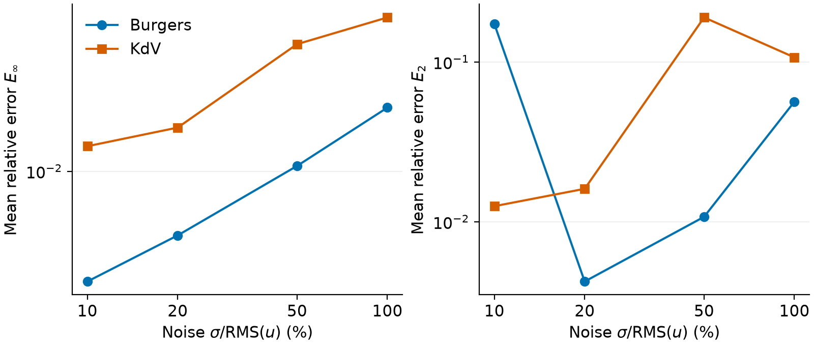

# PDE recovery

Author datasets; Burgers 256×256, KdV 400×601; 43 candidate terms.
Layout follows [WSINDy Table 5 and Figure 6](https://arxiv.org/html/2007.02848v3#S5.T5).

**Noiseless coefficient error E∞** (relative error, not %).

| Method | Burgers | KdV |
|---|---:|---:|
| WSINDy paper, Table 5 | 4.3e-5 | 3.1e-7 |
| WSINDy | 4.31e-05 | 3.14e-07 |
| WENDy HT | 1 | 5.33e-07 |
| WENDy L1=1e-06 | 1 | 0.000216 |
| WENDy L1=0.0001 | 20.4 | 0.022 |
| WENDy L1=0.01 | 0.128 | 1 |
| WENDy-MLE HT | 1 | 5.33e-07 |
| WENDy-MLE L1=1e-06 | 1 | 0.000216 |
| WENDy-MLE L1=0.0001 | 20.4 | 0.022 |
| WENDy-MLE L1=0.01 | 0.128 | 1 |

**Coefficient error versus noise — WSINDy**

Means over 200 seeds per noise level. Only WSINDy has a full noise sweep here;
these are our measurements, not digitized Figure 6 values.

**Method comparison at 20% noise** · 3 paired seeds per PDE.

Support = exact recoveries; E₂ = mean relative error; time = median seconds;
optimizer = successful terminations. L1 labels give α in λ=αλ_ref.

**Burgers**

| Method | Support | E₂ | Time (s) | Optimizer |
|---|---:|---:|---:|---:|
| WSINDy | 3/3 | 0.00484 | 0.05212 | 3/3 |
| WENDy HT | 0/3 | 1 | 457.5 | 0/3 |
| WENDy L1=1e-06 | 0/3 | 9.28e+14 | 511.4 | 0/3 |
| WENDy L1=0.0001 | 0/3 | 2.42e+14 | 6.366 | 0/3 |
| WENDy L1=0.01 | 0/3 | 2e+11 | 139.1 | 3/3 |
| WENDy-MLE HT | 0/3 | 1 | 462.9 | 0/3 |
| WENDy-MLE L1=1e-06 | 0/3 | 1.03e+15 | 966.6 | 3/3 |
| WENDy-MLE L1=0.0001 | 0/3 | inf | 139.9 | 0/3 |
| WENDy-MLE L1=0.01 | 0/3 | inf | 979.7 | 1/3 |

**KdV**

| Method | Support | E₂ | Time (s) | Optimizer |
|---|---:|---:|---:|---:|
| WSINDy | 2/3 | 0.303 | 0.1332 | 3/3 |
| WENDy HT | 0/3 | 1 | 486.9 | 0/3 |
| WENDy L1=1e-06 | 0/3 | 68.3 | 492.2 | 1/3 |
| WENDy L1=0.0001 | 0/3 | 201 | 3.614 | 0/3 |
| WENDy L1=0.01 | 0/3 | 527 | 48.4 | 3/3 |
| WENDy-MLE HT | 0/3 | 1 | 1415 | 0/3 |
| WENDy-MLE L1=1e-06 | 0/3 | 3.29e+03 | 1590 | 1/3 |
| WENDy-MLE L1=0.0001 | 0/3 | 4.07e+03 | 1970 | 0/3 |
| WENDy-MLE L1=0.01 | 0/3 | 547 | 1878 | 1/3 |

E₂ = ‖ŵ−w★‖₂/‖w★‖₂; E∞ = maximum relative error on true nonzero terms.
Failed fits remain included (`inf` = nonfinite error); runtime measures termination, not correct recovery.
Three seeds give a small sample: KdV WSINDy support is 2/3 here versus 198/200 in the noise sweep.

WENDy HT/L1 are PDE extensions using WSINDy test functions; HT knows the true term count.
Fits use at most 300 iterations, tol=1e-8, and known σ for WENDy variants.
Rescaling follows author code (exponent −1/5), which differs from printed Eq. 4.8 (−1/6).

Runtime: Apple M4, Python; FFT/covariance up to 4 threads, BLAS 1. Data generation and file writing excluded.
Paper Table 4 reports 0.12 s / 0.39 s for Burgers / KdV; our single-thread WSINDy medians
at 20% noise are 0.0396 s / 0.133 s (200 seeds). Hardware/language differ.

Full tables: [method comparison](paper_method_comparison/summary.md) ·
[WSINDy sweep](wsindy_paper_reference/summary.md) · [legacy baseline](selection_comparison/summary.md).
